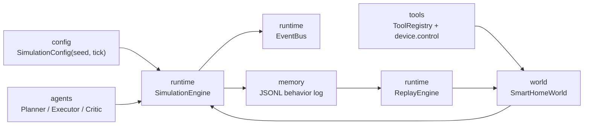

# Research Runtime Architecture

This project now includes a deterministic research runtime beside the original FastAPI and frontend experience. The new core is intentionally small and compatible with the existing `SmartHomeEnvironment`.



## Modules

- `backend/app/world`: deterministic facade for environmental and physical simulation.
- `backend/app/runtime`: tick scheduler, event bus, state diffing, JSONL logging, and replay.
- `backend/app/tools`: schema-backed tool registry. Device state changes go through `device.control`.
- `backend/app/agents/structured_agents.py`: schema-validated Planner, Executor, and Critic outputs.
- `backend/app/memory`: replay log access helpers.
- `backend/app/config`: deterministic simulation settings.

## Demo

```powershell
.\backend\.venv\Scripts\python.exe scripts\run_research_demo.py
```

The demo writes `data/logs/research_demo.jsonl`, executes a structured agent step, advances one tick, and verifies deterministic replay.

## Replay Contract

Each run records:

- `run_started`: seed, tick duration, initial state hash, initial state snapshot.
- `agent_planned` and `agent_executed`: structured JSON decisions.
- `tool_call_completed`: validated tool calls and outputs.
- `tick_completed`: before/after hashes, state snapshot, and field-level diff.

`ReplayEngine` replays every tick from the same seed and compares state hashes with the recorded log.
