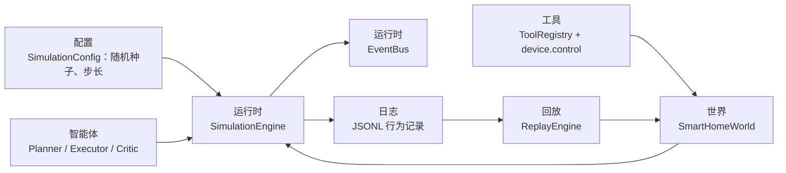

# 研究运行时架构

除原有 FastAPI 与前端交互路径外，项目还提供一个确定性的研究运行时。其核心保持轻量，并与现有 `SmartHomeEnvironment` 兼容，用于可回放的结构化智能体实验。



## 模块

- `backend/app/world`：环境与物理仿真的确定性门面。
- `backend/app/runtime`：步进调度、事件总线、状态差异、JSONL 日志和回放。
- `backend/app/tools`：基于模式的工具注册表，设备状态统一通过 `device.control` 变化。
- `backend/app/agents/structured_agents.py`：经模式验证的规划、执行和批评输出。
- `backend/app/memory`：回放日志访问工具。
- `backend/app/config`：确定性仿真设置。

## 演示与回放

```powershell
.\backend\.venv\Scripts\python.exe scripts\run_research_demo.py
.\backend\.venv\Scripts\python.exe scripts\replay_research_log.py data\logs\research_demo.jsonl
```

演示会写入 `data/logs/research_demo.jsonl`，执行一次结构化智能体步骤、推进一个仿真 tick，并验证确定性回放。

## API

- `POST /api/research/run`：执行一个确定性结构化智能体 tick 并写入 JSONL。
- `GET /api/research/logs`：列出可用研究日志。
- `POST /api/research/replay`：回放 JSONL、在存在语义输入来源时验证规划器输出，并比较状态哈希。

## 回放契约

每次运行记录：

- `run_started`：随机种子、tick 时长、初始状态哈希和初始状态快照。
- `agent_semantic_input`：结构化语义输入和规范化 SHA-256 指纹。
- `agent_planned`、`agent_executed`：结构化 JSON 决策。
- `tool_call_completed`：经验证的工具调用与输出。
- `tick_completed`：前后状态哈希、状态快照和字段级差异。

`ReplayEngine` 从同一随机种子回放每个 tick 并比较状态哈希。日志含有 `agent_semantic_input` 时，还会重新运行确定性规划器并报告不匹配；旧日志没有该事件时仍可执行回放，但会明确标记 `unverified_plans`，不能支撑“语义到规划可复现”的结论。
